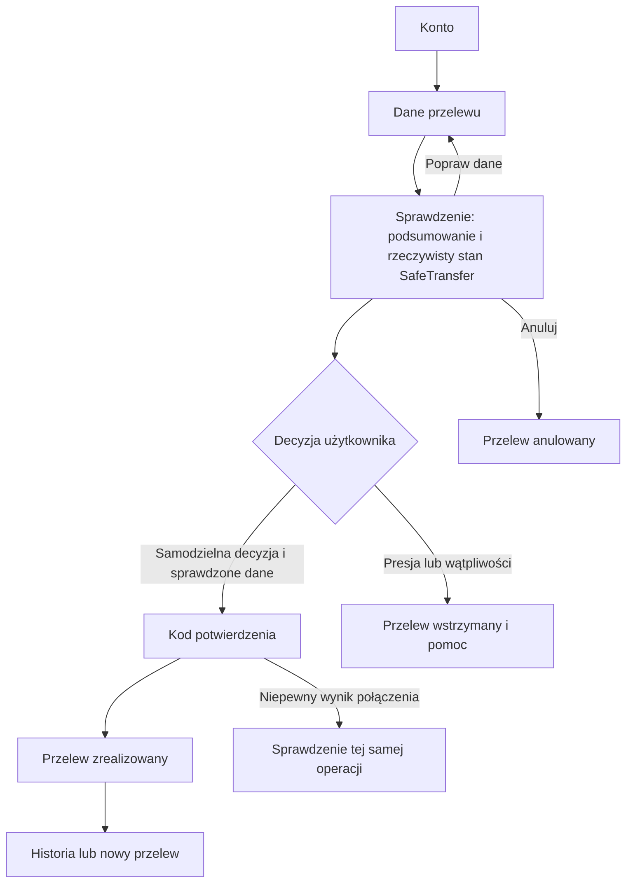

# Audyt frontendu Bank24 / SafeTransfer

Data: 4 października 2026. Zakres: obecna aplikacja React w `frontend/`, UI/UX, przepływ przelewu, dostępność i sygnały „AI slop”. Referencja wizualna: załączona przez użytkownika plansza dziewięciu ekranów Bank24. Treści repozytorium potraktowano jako kontekst; aktualna prośba użytkownika wyznacza kierunek.

## Wniosek

Obecny interfejs ma działającą bazę aplikacji bankowej, ale jego kompozycja, komunikaty i część widocznych kontrolek obniżają wiarygodność. Największy problem to rozjazd między wyglądem a zachowaniem: dekoracyjne elementy sugerują funkcje, których nie mają, a komunikaty bezpieczeństwa sugerują możliwości, których model nie dostarcza. Do tego dochodzą istotne błędy mobilne.

Rekomendacja: przebudować warstwę prezentacji według załączonych mockupów, zachowując kontrakt API, walidację, sesję, zgody, wersjonowanie przelewów i zabezpieczenie przed podwójnym obciążeniem. Sama zmiana kolorów lub fontu nie usunie źródła problemu.

## Metoda i ograniczenia

- Przeczytano routing, layout, wspólne komponenty, CSS oraz ekrany udziału, logowania, rachunku, przelewów, historii, kamery i pomocy. Sprawdzono kontekst produktu i istniejący system wizualny.
- Playwright / Chrome: przejście rzeczywistego przepływu na osobnym API i osobnej bazie SQLite, bez zmiany salda uruchomionej demonstracji użytkownika. Utworzono po jednym przelewie testowym 1 zł dla desktopu i telefonu.
- 12 ekranów × 2 szerokości: 1440 × 1000 i 390 × 844. Dodatkowo zmierzono pulpit i formularz przelewu przy 390, 768 i 1024 px. Zrzuty obejmują pełną wysokość strony.
- Axe: 24 skany WCAG A/AA, w tym WCAG 2.1 AA. Jeden ekran zgłosił problem: przewijana sekcja filtrów historii na telefonie. Brak zgłoszeń na pozostałych ekranach nie potwierdza pełnej dostępności.
- Detektor Impeccable: `detect --json frontend/src` zwrócił `[]`. Ręczna kontrola i przeglądarka wykryły problemy, których ten skan nie wskazał.
- Nie uruchamiano fizycznej kamery. Problem ukrytego panelu przy aktywnym strumieniu wynika z kodu; nie jest wynikiem testu transmisji w tym audycie.
- Brak pomiaru Core Web Vitals, testów na fizycznym telefonie, pełnego testu czytnikiem ekranu i badania z użytkownikami. Oceny wizualne są oceną ekspercką, nie pomiarem konwersji.
- Audyt nie zmienia kodu aplikacji. Skrypty, zrzuty i dane pomiarowe są artefaktami audytu.

Dowody: [evidence.json](evidence.json), [layout-evidence.json](layout-evidence.json), [capture.mjs](capture.mjs), [verify-layout.mjs](verify-layout.mjs).

## Ocena techniczna

Skala 0–4 za obszar, według rubryki audytu Impeccable. Jest to ocena jakości implementacji; nie jest procentem poprawności aplikacji ani oceną backendu.

| Obszar | Ocena | Uzasadnienie |
|---|---:|---|
| Dostępność | 2/4 | Semantyczne formularze i widoczny focus są dobrą bazą; filtry, focus po zmianie trasy i mały cel Pomocy wymagają poprawy. |
| Wydajność | 2/4, wstępna | Lokalne fonty z `swap`, brak błędów JS w badanym przepływie; zdjęcie ładowane z zewnętrznego CDN w kilku wariantach, bez pomiarów CWV. |
| Responsywność | 0/4 | Formularz przelewu praktycznie nieczytelny na 390 px; pulpit ucina zawartość. |
| Spójność tokenów i stylów | 1/4 | Bazowe tokeny istnieją, lecz kolejne bloki CSS nadpisują je własnymi kolorami, promieniami i układami. Nie oceniam braku dark mode jako wady. |
| Integralność interfejsu | 1/4 | Niedziałające filtry, stały wykres, dzwonek wylogowujący użytkownika i niespójne obietnice bezpieczeństwa. |
| **Razem** | **6/20** | **Warstwa UI wymaga przebudowy i napraw zachowania.** |

## Potwierdzone problemy i rozwiązania

P1: znacznie utrudnia zadanie lub podważa zaufanie. P2: pogarsza zrozumienie lub wygodę, ale istnieje obejście. Nie stwierdzono P0 w przeprowadzonym scenariuszu: automatyzacja ukończyła przelew, choć mobilny układ jest praktycznie nieużyteczny dla człowieka.

### F01 — P1: formularz przelewu rozpada się na telefonie

**Miejsce:** `frontend/src/design/styles.css:1290`, wcześniejszy breakpoint `:1065`, układ mobilny `:1419`.

Późniejsza reguła `.bank-layout` przywraca dwie kolumny z panelem kamery 304 px i odstępem 20 px. Breakpoint nie przywraca jednej kolumny. Przy 390 px przeglądarka zmierzyła główną kolumnę na **16 px**, mimo zwiniętego mobilnego panelu kamery. Przy 768 px kolumna formularza nadal ma tylko 338 px, a kamera rezerwuje drugi tor. Formularz 390 px daje stronę wysokości 3160 px i łamie tekst na bardzo krótkie fragmenty.

**Rozwiązanie:** jeden jawny layout mobilny z `minmax(0, 1fr)`; formularz pierwszy, kontekst faktury dostępny blisko pól, kamera jako zwijany moduł po zadaniu. Zrezygnować z wielokrotnego nadpisywania tego samego układu.

Dowód: [transfer-390.png](transfer-390.png), [layout-evidence.json](layout-evidence.json).

### F02 — P1: pulpit ucina kwoty i karty

**Miejsce:** `frontend/src/design/styles.css:164` (`overflow: clip`), `:1356`, `:1357`, `:1367`.

Na telefonie karta rachunku i podsumowania kończą się przy x=407 px, choć prawa krawędź obudowy aplikacji jest przy x=378 px. Treść jest obcinana. Pomiar `document.scrollWidth === viewportWidth` tego nie ujawnia: nadmiar jest ukryty, a nie przewijany. Dodatkowo kwoty miesięczne sklejają się z etykietami, bo wewnętrzne bloki nie dostają właściwego układu.

**Rozwiązanie:** minimalne szerokości dzieci siatki ustawić na zero, zdefiniować własny layout statystyk i transakcji dla telefonu, pozwolić kwotom przejść do osobnego wiersza. Sprawdzać granice dzieci i czytelność, nie tylko brak poziomego scrolla.

Dowód: [dashboard-390.png](dashboard-390.png).

### F03 — P1: dzwonek wylogowuje użytkownika

**Miejsce:** `frontend/src/layouts/RootLayout.tsx:87`, `:102`.

Dzwonek, avatar, nazwa użytkownika i tekst Wyloguj są jednym przyciskiem obsługującym logout. Kliknięcie dzwonka w przeglądarce przeniosło na `/study`. Na telefonie napis Wyloguj znika, ale akcja nadal obejmuje profil i dzwonek. Użytkownik nie ma możliwości przewidzieć skutku.

**Rozwiązanie:** osobna akcja Wyloguj. Profil może otwierać menu, jeśli faktycznie je zbudujemy. Dzwonek usunąć do czasu wdrożenia powiadomień albo nadać mu rzeczywistą funkcję.

Dowód: wpis `bell-click` w [layout-evidence.json](layout-evidence.json).

### F04 — P1: obietnice ochrony nie odpowiadają działaniu prototypu

**Miejsce:** `frontend/src/layouts/RootLayout.tsx:128`, `:129`, `:133`; `frontend/src/features/transfers/pages.tsx:362`.

Login deklaruje „Twoje dane i środki są zawsze pod naszą ochroną” oraz „Stały monitoring transakcji 24/7”. Podsumowanie mówi „Sprawdzamy, czy ten przelew jest bezpieczny”, podczas gdy wynik jawnie nie pozwala określić ryzyka. To sprzeczność pomiędzy marketingiem a stanem systemu. Pasek demonstracji oraz stopki logowania i banku są ukryte przez CSS (`styles.css:1277`, `:1294`, `:1295`), więc nie każdy ekran ma czytelną informację o symulacji.

**Rozwiązanie:** stałe, dyskretne oznaczenie „Demo · fikcyjne środki”. Opisywać to, co działa: sprawdzenie danych, dodatkowe pytanie bezpieczeństwa i potwierdzenie kodem. Gdy model nie dostarcza oceny, napisać „Ocena automatyczna niedostępna. Sprawdź dane przelewu”. Obietnice skuteczności dopiero po walidacji.

### F05 — P1: podsumowanie finansów zawiera wymyślony sygnał

**Miejsce:** `frontend/src/design/styles.css:1361`; `frontend/src/features/accounts/pages.tsx:90`.

Pasek ma zawsze szerokość 68%, niezależnie od wartości. Tekst „Masz więcej wpływów niż wydatków” jest bezwarunkowy. Obecne dane go uzasadniają, ale po zmianie relacji wpływów i wydatków tekst pozostanie taki sam. W bankowości wykres musi mieć definicję i wynikać z danych.

**Rozwiązanie:** usunąć pasek lub policzyć go z jasno opisanej relacji, z obsługą wartości zerowych. Wniosek tekstowy uzależnić od danych. Bez wymyślonego wzrostu salda lub procentu z mockupu.

### F06 — P1: aktywna kamera może zniknąć z kontroli użytkownika

**Miejsce:** `frontend/src/layouts/RootLayout.tsx:27`, `:148`; `frontend/src/features/camera/CameraPanel.tsx` i `store.ts`.

Panel widoczny jest tylko przy logowaniu, kodzie logowania i nowym przelewie. Pozostaje zamontowany, lecz dostaje `hidden` na pulpicie, historii, podsumowaniu i wyniku. Sama zmiana trasy nie zatrzymuje strumienia. Jeśli użytkownik włączył kamerę, może stracić widoczny przycisk jej wyłączenia w dalszych krokach.

**Rozwiązanie:** mały, stały status kamery z przyciskiem Wyłącz w pasku aplikacji; pełny panel przy przelewie. Alternatywne automatyczne zatrzymanie wymaga zgodności z protokołem badania. Parametry techniczne schować w szczegółach lub widoku operatora.

Ocena na podstawie kodu; nie włączano urządzenia podczas audytu.

### F07 — P1: filtry historii są dekoracją

**Miejsce:** `frontend/src/features/accounts/pages.tsx:194`; `frontend/src/design/styles.css:1431`.

„Wszystkie”, „Wpływy”, „Wydatki” to elementy `span`, bez obsługi kliknięcia, klawiatury ani filtrowania. Wygląd sugeruje działające przyciski. Na telefonie przewijany kontener zgłasza w Axe `scrollable-region-focusable`.

**Rozwiązanie:** prawdziwe przyciski z `aria-pressed`, działającym filtrowaniem i stanem w URL. Jeśli filtr dotyczy całej historii, jego obsługa musi poprzedzać paginację. Nie wystarczy dodać `tabIndex` do dekoracji.

### F08 — P2: historia utrudnia odnalezienie operacji

**Miejsce:** `frontend/src/features/accounts/pages.tsx:166`, `:170`; `frontend/src/design/styles.css:1385`.

Wyszukiwanie obejmuje tylko pobraną stronę 30 operacji. Etykieta uczciwie to mówi, ale użytkownik nadal nie wyszuka łatwo całej historii. Stan znika po opuszczeniu widoku. Na desktopie każdy wiersz dodatkowo rezerwuje pustą kolumnę 88 px przez pseudoelement, bez wyświetlenia daty w tej kolumnie.

**Rozwiązanie:** wyszukiwanie całej historii w API i query params; datę, odbiorcę, tytuł, kwotę oraz status pokazać w prawdziwej tabeli na desktopie. Na telefonie każdy wiersz powinien być czytelnym blokiem z kwotą i datą.

### F09 — P2: wyłączona kamera udaje podgląd

**Miejsce:** `frontend/src/design/styles.css:1448`; `frontend/src/features/camera/CameraPanel.tsx`.

W pustym panelu kamery widać to samo zdjęcie stockowe co w marketingowej części logowania. Zielona kropka jest także przy stanie „Kamera wyłączona”. Użytkownik może odczytać to jako obraz z urządzenia lub potwierdzoną ochronę, mimo tekstu o wyłączonym podglądzie.

**Rozwiązanie:** neutralne, jednolite pole z ikoną kamery i etykietą „Wyłączona”. Stan aktywny dopiero po rzeczywistym połączeniu. Używać kolorów konsekwentnie; obraz dekoracyjny pozostawić wyłącznie w strefie marketingowej.

### F10 — P2: logowanie i przelew mają konkurujące hierarchie

**Miejsce:** `frontend/src/layouts/RootLayout.tsx:125`; `frontend/src/design/styles.css:1297`, `:1390`.

Logowanie ma trzy silne kolumny: marketing, formularz i kamera. Ten sam portret występuje w tle, dekoracyjnym wycięciu i panelu kamery. Na 1440 px nagłówek logowania jest większy niż wymaga krótkie zadanie. Przelew ma formularz, fakturę i kamerę, a duże odstępy odsuwają główną akcję poniżej pierwszego ekranu. Po wejściu do podsumowania układ ponownie zmienia geometrię.

**Rozwiązanie:** logowanie jako spokojny układ dwóch części; kamera jako drugorzędny, zwijany moduł. Po zalogowaniu stały sidebar i topbar. Formularz oraz jego kontekst mają przewidywalne miejsce w każdym kroku. Zmniejszyć odstępy i nagłówki bez zmniejszania czytelności pól.

### F11 — P2: „Sprawdzenie” rozciąga się na kilka ekranów

**Miejsce:** `frontend/src/features/transfers/pages.tsx:359`, `:395`, `:447`, `:586`.

Obecna ścieżka przelewu wymaga kolejno: zapisu formularza, przejścia przez komunikat o braku oceny, osobnej deklaracji samodzielności i porównania danych, zamówienia kodu, a potem jego wpisania. Dwa różne ekrany pokazują ten sam etap „Sprawdzenie”. Nie jest to dowód, że wszystkie kroki są zbędne: część wynika z reguł serwera i badania. Jednak wizualny model trzech etapów nie wyjaśnia rzeczywistej liczby decyzji.

**Rozwiązanie:** cztery logiczne etapy: Dane → Sprawdzenie → Kod → Wynik. Podsumowanie, brak automatycznej oceny i pytanie bezpieczeństwa zebrać na jednym ekranie. Zamawianie kodu włączyć do świadomej akcji „Przejdź do kodu”; API nadal egzekwuje wszystkie reguły. Ręczne przepisywanie faktury zachować, jeśli mierzy zachowanie uczestnika.

### F12 — P2: wynik przelewu mówi językiem implementacji

**Miejsce:** `frontend/src/features/transfers/pages.tsx:730`, `:768`.

„Saldo i historia zostały zaktualizowane na serwerze”, wersja danych i długi identyfikator zajmują miejsce, w którym użytkownik potrzebuje pewności: jaka kwota, dla kogo i jaki jest wynik. Wielkie odstępy oddzielają potwierdzenie od działań.

**Rozwiązanie:** w centrum ikona stanu, „Przelew zrealizowany”, kwota i odbiorca; dalej czytelne szczegóły, „Nowy przelew” i „Historia”. Numer operacji zachować w szczegółach; wersję danych przenieść do diagnostyki. Nie deklarować doręczenia prawdziwych środków w demonstracji.

### F13 — P2: focus i małe cele dotykowe wymagają dopracowania

**Miejsce:** `frontend/src/layouts/RootLayout.tsx:35`; `frontend/src/features/accounts/pages.tsx:62`; `frontend/src/design/styles.css:1416`.

Focus kierowany jest do pierwszego `h1`. Na logowaniu jest to marketingowy nagłówek poza `main`, bez `tabIndex`; na pulpicie nagłówek jest ukryty i także nie jest focusowalny. Pomoc na telefonie ma obszar około 20 × 44 px. Nie oznaczam tego pomiaru jako automatycznie potwierdzonego naruszenia WCAG 2.2: dopuszczalne są wyjątki dotyczące odstępów.

**Rozwiązanie:** jeden główny nagłówek zadania, focusowalny po zmianie trasy; dekoracyjny tekst marketingowy jako osobny element. Ikonę Pomocy umieścić w celu 44 × 44 px. Przejść główny przepływ samą klawiaturą i czytnikiem ekranu.

### F14 — P2: CSS nie ma stabilnego źródła prawdy

**Miejsce:** `frontend/src/design/styles.css:1276` i kolejne bloki do końca pliku.

Po podstawowym systemie i breakpointach dopisano kolejne warstwy nadpisujące kolumny, panele, zdjęcia, promienie, kolory i przyciski. Stąd błąd mobilny i dryf wobec `DESIGN.md`. Selektor `:has(.transfer-details)` ustawia layout wielu ekranów przez strukturę potomków i numerowane wiersze siatki, co daje przypadkowe odstępy i utrudnia rozwój.

**Rozwiązanie:** jawne layouty AuthLayout, BankLayout i TransferLayout; osobne warianty widoków zamiast geometrii zależnej od potomków. Jeden zestaw tokenów; usunąć zastąpione style, zamiast dopisywać następne nadpisania.

### Dodatkowe obserwacje

- Ikona kopiowania rachunku (`accounts/pages.tsx:68`) nie jest przyciskiem i nie kopiuje. Wdrożyć rzeczywiste kopiowanie z komunikatem „Skopiowano” albo usunąć ikonę.
- Pomoc opisuje kamerę „po lewej” (`HelpPage.tsx:69`), choć obecnie jest po prawej. Użyć wskazania niezależnego od położenia: „w panelu Kamera”.
- Wycofanie udziału usuwa dane sesji bez osobnego potwierdzenia (`HelpPage.tsx:90`). Zalecane potwierdzenie z krótkim opisem skutku i możliwością powrotu. Tej operacji nie wykonywano w audycie.
- OTP wygląda jak cztery segmenty, lecz dopuszcza sześć znaków. Wygląd, długość kodu i komunikat powinny wynikać z jednego kontraktu. Można zachować pojedynczy input, aby ułatwić wklejanie i autouzupełnianie.

## Co tutaj wygląda jak „AI slop”

Termin opisuje odbiór i cechy interfejsu; nie dowodzi sposobu jego powstania.

1. **Gotowe slogany bez pokrycia:** ochrona „zawsze”, monitoring 24/7, bezpieczeństwo bez działającej oceny.
2. **Dekoracje udające funkcje:** filtry, copy icon, dzwonek z kropką oraz wykres 68%.
3. **Nadmiar podobnych powierzchni:** gradient strony, gradient rachunku, miętowe panele, okrągłe ikony, przyciski kapsułki, duża obudowa z cieniem.
4. **Przypadkowe obrazowanie:** to samo zdjęcie wykorzystane trzykrotnie, także w wyłączonej kamerze. Fotografia nie buduje opowieści o produkcie.
5. **Stylowanie zamiast kompozycji:** każdy fragment dostał ozdobę, ale relacje między zadaniem, kontekstem i następną akcją pozostają słabe.

Środek zaradczy: mniej dekoracji, więcej widocznych działających funkcji, prawdziwych danych i konsekwentnej hierarchii. Granat i teal same w sobie nie są problemem; odpowiadają wybranej referencji.

## Co zachować

- Działającą ścieżkę od udziału po wynik przelewu. W obu przebadanych rozmiarach backend obsłużył całą operację; nie odnotowano błędów JavaScript.
- Czytelne etykiety, natywne pola, widoczny focus, skip link, semantyczne komunikaty błędów i numerowanie etapów.
- Lokalne fonty, logo SVG, tabularne liczby, walidację kwot i NRB, zachowanie szkicu oraz możliwość powrotu do edycji.
- Osobną zgodę kamery i opcjonalny charakter pomiaru. Rozróżnienie „brak oceny” od „niskie ryzyko”.
- Atomowy zapis, obsługę ponowienia i wersjonowanie opisane w kodzie/API. Redesign nie powinien ingerować w te mechanizmy bez potrzeby. Audyt nie zastępuje ich pełnej regresji.

## Jak przełożyć mockupy na rzeczywistą aplikację

Plansza ma dobry kierunek: białe powierzchnie, chłodne tło, mała identyfikacja, granatowe akcje, zwięzłe teksty, stała nawigacja boczna oraz czytelne zakończenie zadania. Jej małe napisy wynikają częściowo z tego, że wiele ekranów pokazano razem; nie należy kopiować ich rozmiaru piksel w piksel.

| Ekran | Docelowa kompozycja | Dostosowanie do możliwości prototypu |
|---|---|---|
| Landing | Jeden mocny kadr gór lub inny zaakceptowany obraz, krótki komunikat, dwa CTA | „Rozpocznij demo” i „Jak działa SafeTransfer”; brak fikcyjnego otwierania prawdziwego konta. Landing jest nowym ekranem, obecnie `/` prowadzi do udziału. |
| Logowanie | Dwie części: wąski panel wizerunkowy oraz spokojny formularz | Dane demo jako pomoc rozwijana; kamera ma niższy priorytet, może być dostępna jako moduł rozwijany po zgodzie. |
| Kod logowania | Centralny panel około 400–440 px, logo, pole kodu, ponowienie, powrót | Testowy kod i brak SMS jawnie oznaczone; długość kodu zgodna z API. Jedno pole może wyglądać jak segmenty. |
| Pulpit | Sidebar, lekki topbar, jasna karta salda i ostatnie operacje obok | Główna akcja „Nowy przelew”; realne wartości. Bez wymyślonego wykresu wzrostu. |
| Nowy przelew | Formularz w głównej kolumnie; kompaktowy kontekst faktury i kamera z boku | Faktura jest elementem zadania badawczego, mimo że nie ma jej na planszy. Parametry domyślnie schowane. |
| Sprawdzenie | Podsumowanie plus rzeczywisty stan oceny i pytanie bezpieczeństwa | Bez pozorowanego skanowania lub procentu postępu. Animowana analiza dopiero, gdy system rzeczywiście wykonuje pracę i raportuje jej stan. |
| Wynik | Ikona stanu, kwota, odbiorca, zwarta tabela szczegółów, dwie akcje | Osobne warianty: zrealizowany, anulowany, wstrzymany, status niepotwierdzony. |
| Historia | Tabela z nagłówkami, wyszukiwanie i działające filtry | Na telefonie bloki transakcji; wyszukiwanie całej historii, nie tylko bieżącej strony. |
| Pomoc | Krótkie tematy według zadania, powrót do zachowanego kontekstu | Tylko działające kanały pomocy; nie dodawać fikcyjnej infolinii, czatu ani kontaktów z planszy. |

Nie kopiować menu Kart, Oszczędności, BLIK ani płatności cyklicznych, dopóki nie mają funkcji. Nie dodawać logowania aplikacją mobilną bez takiego mechanizmu. Potencjalne zakładki klienta indywidualnego i firmy także wymagają rzeczywistej różnicy w działaniu.

### Wstępne zasady wizualne

- Tło aplikacji jednolite i chłodne; białe panele. Granat jako tekst i akcja główna, teal jako ograniczony akcent. Kolory statusów odrębne od koloru marki.
- Sidebar około 200–224 px na desktopie; topbar około 64 px. Na telefonie kompaktowa nawigacja Konto / Przelew / Historia i dostępna Pomoc, bez pustego toru sidebara.
- Nagłówki zadaniowe około 24–28 px na desktopie; tekst bazowy 15–16 px; pomocniczy 13–14 px. Saldo około 32–40 px. Konkretne rozmiary sprawdzić w docelowym układzie.
- Promień pól i przycisków około 6–8 px, paneli około 10–12 px. Cień tylko tam, gdzie tłumaczy nakładanie warstw.
- Pola około 44–48 px wysokości; cele dotykowe minimum 44 px jako zasada projektowa. Wyraźny focus, czytelne etykiety i obsługa powiększenia.
- Jedna główna akcja w każdym kroku. Szczegóły techniczne w rozwinięciu; bankowe dane potrzebne do decyzji widoczne od razu.
- Istniejący IBM Plex Sans można zachować. Najpierw poprawić kompozycję i rytm typograficzny; zmiana fontu nie jest konieczna do osiągnięcia kierunku z planszy.

## Docelowy user flow

Publiczne wejście: Landing → Rozpocznij demo → Kod uczestnika i zasady udziału → Login → Kod logowania → Konto.

Jeśli aplikacja ma być dostępna wyłącznie w badaniu, landing może być opcjonalny, a link od operatora prowadzić bezpośrednio do udziału. Zgód i wymaganego identyfikatora uczestnika nie usuwamy dla samego uproszczenia wyglądu.

Warunek „sprawdzone dane” należy zachować w regułach serwera. Ścieżka wstrzymania powinna dawać szybki bezpieczny krok; obecny wymóg zaznaczenia porównania dokumentu także przy zgłoszeniu presji warto zweryfikować z protokołem badania. Zmiana tego warunku wymaga osobnej decyzji produktowej i testów backendu.

## Potencjalne rozwiązania

| Wariant | Zakres | Efekt i ograniczenie |
|---|---|---|
| A. Naprawa obecnego UI | Responsywność, dzwonek, filtry, prawdziwe podsumowanie, teksty, kontrola kamery | Najmniejszy zakres; usuwa główne błędy, ale utrzymuje obecną kompozycję daleką od planszy. |
| **B. Przebudowa UI według mockupów — rekomendowana** | Nowe layouty, sidebar, logowanie, pulpit, cały przelew, historia i pomoc; obecne API | Najlepiej odpowiada prośbie użytkownika. Spójna aplikacja, profesjonalny odbiór i poprawa user flow przy zachowaniu działającej bazy. |
| C. B plus landing i materiały prezentacyjne | Zakres B oraz strona wejściowa, świadomie dobrana fotografia lub własny wizual produktu, prezentacyjna ścieżka demo | Wzmacnia pierwsze wrażenie dla jury; wymaga dodatkowej pracy nad obrazami i treścią. Nie zastępuje jakości aplikacji po zalogowaniu. |

Nie rekomenduję tworzenia kolejnego oddzielnego statycznego prototypu jako zamiennika działającej aplikacji. Kierunek należy wdrożyć w obecnym React.

## Kolejność wdrożenia i kryteria odbioru

1. **Fundament i prawdziwe zachowanie:** usunąć błędy F01–F07, uporządkować tokeny i layouty. Każdy widoczny przycisk robi dokładnie to, co sugeruje etykieta. Oznaczenie demo i kontrola aktywnej kamery dostępne we wszystkich krokach.
2. **Najważniejsza ścieżka:** przebudować Konto → Dane → Sprawdzenie → Kod → Wynik; potem historię. Pulpit i przelew najpierw oceniane wizualnie na 390, 768, 1024 i 1440 px, z faktycznymi danymi i dłuższymi nazwami.
3. **Wejście i pomoc:** ujednolicić udział, login, OTP i pomoc; opcjonalny landing na końcu, gdy rdzeń prezentacji działa.
4. **Odbiór:** jedna kontrola wizualna desktop + mobile, naprawy w jednym zestawie, jedna kontrola potwierdzająca. Regresja istniejących testów przelewu i kamery; test klawiatury, powiększenia 200%, błędów pól, utraty sieci, powrotu i anulowania. Axe jako wsparcie, nie wyłączny warunek odbioru.

Weryfikować także dane: zerowe wpływy, wydatki większe od wpływów, brak historii i wiele stron. Żaden wykres ani komunikat nie może być wpisaną na stałe oceną sytuacji.

## Użyte odniesienia

- Plansza użytkownika: wizualny kierunek banku i sekwencja ekranów.
- [Vercel Web Interface Guidelines](https://raw.githubusercontent.com/vercel-labs/web-interface-guidelines/main/command.md): semantyka kontrolek, focus, formularze, stany i nawigacja. Zalecenia stosowano do polskojęzycznej aplikacji i jej rzeczywistego zakresu, bez bezrefleksyjnego kopiowania angielskich reguł copy.
- Lokalne instrukcje Impeccable: rubryka audytu technicznego i detektor. Wynik detektora oddzielono od oceny wizualnej i zachowania w przeglądarce.

Serwery użyte wyłącznie do audytu: API 8083, Vite 5181. Skrypty zakładają te porty i osobną bazę `data/frontend-audit-2026-10-04.sqlite`; przed powtórzeniem należy uruchomić oba serwery. Po audycie zostają zatrzymane. Zrzuty są migawką obecnego UI z dnia audytu, nie propozycją nowej implementacji.
